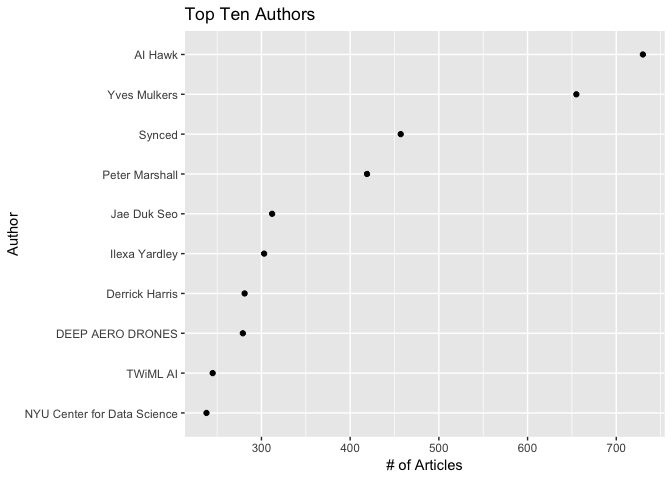
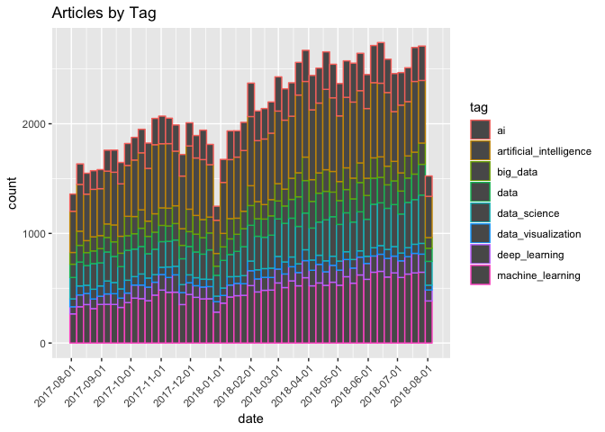
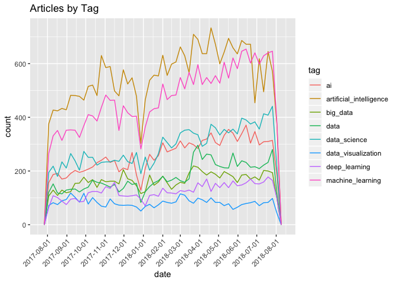
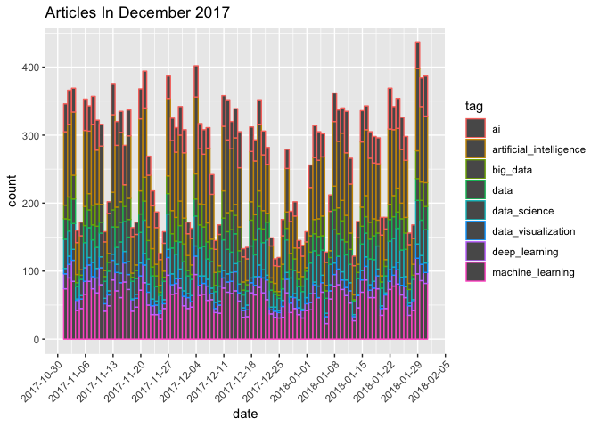
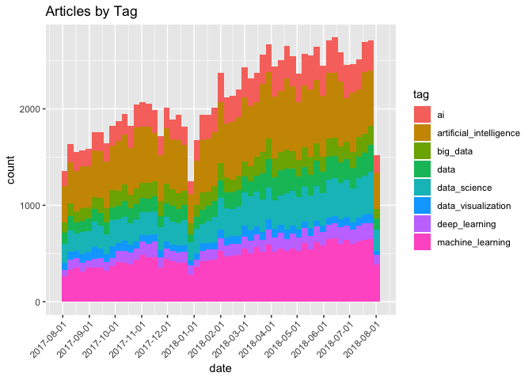
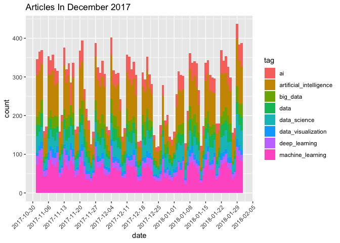

Upload the data
---------------

    df <- read_csv("~/Box/Tidy_Tuesday/2018_12_4/data/1_original/medium_datasci.csv")

    ## Parsed with column specification:
    ## cols(
    ##   .default = col_integer(),
    ##   title = col_character(),
    ##   subtitle = col_character(),
    ##   author = col_character(),
    ##   publication = col_character(),
    ##   claps = col_double(),
    ##   url = col_character(),
    ##   author_url = col_character()
    ## )

    ## See spec(...) for full column specifications.

Brief exploration
=================

    glimpse(df)

    ## Observations: 78,388
    ## Variables: 21
    ## $ x1                          <int> 2, 5, 11, 12, 17, 18, 28, 30, 33, ...
    ## $ title                       <chr> "Online Animation: Mixamo vs Norah...
    ## $ subtitle                    <chr> "Online animations tools provide g...
    ## $ image                       <int> 1, 0, 1, 1, 1, 1, 1, 0, 1, 0, 1, 1...
    ## $ author                      <chr> "Emma Laurent", "Sanparith Marukat...
    ## $ publication                 <chr> NA, NA, NA, "MILLENNIALSTIMES", "N...
    ## $ year                        <int> 2017, 2017, 2017, 2017, 2017, 2017...
    ## $ month                       <int> 8, 8, 8, 8, 8, 8, 8, 8, 8, 8, 8, 8...
    ## $ day                         <int> 1, 1, 1, 1, 1, 1, 1, 1, 1, 1, 2, 2...
    ## $ reading_time                <int> 5, 2, 3, 5, 3, 6, 5, 0, 4, 3, 3, 6...
    ## $ claps                       <dbl> 12, 11, 1, 4, 56, 103, 2, 2, 1, 0,...
    ## $ url                         <chr> "https://medium.com/@laurentemma/o...
    ## $ author_url                  <chr> "https://medium.com/@laurentemma",...
    ## $ tag_ai                      <int> 1, 1, 1, 1, 1, 1, 1, 1, 1, 1, 1, 1...
    ## $ tag_artificial_intelligence <int> 0, 0, 0, 0, 0, 0, 0, 0, 0, 0, 0, 0...
    ## $ tag_big_data                <int> 0, 0, 0, 0, 0, 0, 0, 0, 0, 0, 0, 0...
    ## $ tag_data                    <int> 0, 0, 0, 0, 0, 0, 0, 0, 0, 0, 0, 0...
    ## $ tag_data_science            <int> 0, 0, 0, 0, 0, 0, 0, 0, 0, 0, 0, 0...
    ## $ tag_data_visualization      <int> 0, 0, 0, 0, 0, 0, 0, 0, 0, 0, 0, 0...
    ## $ tag_deep_learning           <int> 0, 0, 0, 0, 0, 0, 0, 0, 0, 0, 0, 0...
    ## $ tag_machine_learning        <int> 0, 0, 0, 0, 0, 0, 0, 0, 0, 0, 0, 0...

    skimr::skim(df)

    ## Skim summary statistics
    ##  n obs: 78388 
    ##  n variables: 21 
    ## 
    ## ── Variable type:character ───────────────────────────────────────────────────────────────────────────────────────────
    ##     variable missing complete     n min max empty n_unique
    ##       author     286    78102 78388   1  56     0    33304
    ##   author_url       0    78388 78388  19  68     0    36006
    ##  publication   44072    34316 78388   1 133     0     7297
    ##     subtitle   30069    48319 78388   1 362     0    45838
    ##        title    1822    76566 78388   1 230     0    73953
    ##          url       0    78388 78388  36 827     0    78388
    ## 
    ## ── Variable type:integer ─────────────────────────────────────────────────────────────────────────────────────────────
    ##                     variable missing complete     n       mean        sd
    ##                          day       0    78388 78388     15.7        8.8 
    ##                        image       0    78388 78388      0.65       0.48
    ##                        month       0    78388 78388      6.21       3.31
    ##                 reading_time       0    78388 78388      4.31       3.35
    ##                       tag_ai       0    78388 78388      0.18       0.38
    ##  tag_artificial_intelligence       0    78388 78388      0.38       0.48
    ##                 tag_big_data       0    78388 78388      0.11       0.31
    ##                     tag_data       0    78388 78388      0.12       0.33
    ##             tag_data_science       0    78388 78388      0.2        0.4 
    ##       tag_data_visualization       0    78388 78388      0.055      0.23
    ##            tag_deep_learning       0    78388 78388      0.084      0.28
    ##         tag_machine_learning       0    78388 78388      0.32       0.47
    ##                           x1       0    78388 78388 130632.97  147899.21
    ##                         year       0    78388 78388   2017.66       0.47
    ##    p0     p25   p50       p75   p100     hist
    ##     1    8       16     23        31 ▇▇▇▇▆▇▇▆
    ##     0    0        1      1         1 ▅▁▁▁▁▁▁▇
    ##     1    3        6      9        12 ▆▃▇▃▅▅▃▆
    ##     0    2        4      5       100 ▇▁▁▁▁▁▁▁
    ##     0    0        0      0         1 ▇▁▁▁▁▁▁▂
    ##     0    0        0      1         1 ▇▁▁▁▁▁▁▅
    ##     0    0        0      0         1 ▇▁▁▁▁▁▁▁
    ##     0    0        0      0         1 ▇▁▁▁▁▁▁▁
    ##     0    0        0      0         1 ▇▁▁▁▁▁▁▂
    ##     0    0        0      0         1 ▇▁▁▁▁▁▁▁
    ##     0    0        0      0         1 ▇▁▁▁▁▁▁▁
    ##     0    0        0      1         1 ▇▁▁▁▁▁▁▃
    ##     0 8180.75 30598 266207.25 437504 ▇▁▁▁▁▁▁▁
    ##  2017 2017     2018   2018      2018 ▅▁▁▁▁▁▁▇
    ## 
    ## ── Variable type:numeric ─────────────────────────────────────────────────────────────────────────────────────────────
    ##  variable missing complete     n   mean     sd p0 p25 p50 p75  p100
    ##     claps       0    78388 78388 123.05 822.99  0   0   4  55 60000
    ##      hist
    ##  ▇▁▁▁▁▁▁▁

Explore Tag columns
===================

Are the tags mutually exclusive?

    tags_df <- df %>% select(starts_with("tag"))
    num_tags <- tags_df %>% 
      summarise_at(1:ncol(.), ~sum(.)) %>% 
      gather(tag, n) %>% 
      mutate(tag = str_remove(tag, "tag_")) %>% 
      arrange(desc(n))
    num_tags

    ## # A tibble: 8 x 2
    ##   tag                         n
    ##   <chr>                   <int>
    ## 1 artificial_intelligence 29580
    ## 2 machine_learning        25175
    ## 3 data_science            15424
    ## 4 ai                      13763
    ## 5 data                     9420
    ## 6 big_data                 8686
    ## 7 deep_learning            6612
    ## 8 data_visualization       4334

Gather Tags example
===================

    tags2_df <- df %>% select("x1", starts_with("tag"))
    tags2_df

    ## # A tibble: 78,388 x 9
    ##       x1 tag_ai tag_artificial_… tag_big_data tag_data tag_data_science
    ##    <int>  <int>            <int>        <int>    <int>            <int>
    ##  1     2      1                0            0        0                0
    ##  2     5      1                0            0        0                0
    ##  3    11      1                0            0        0                0
    ##  4    12      1                0            0        0                0
    ##  5    17      1                0            0        0                0
    ##  6    18      1                0            0        0                0
    ##  7    28      1                0            0        0                0
    ##  8    30      1                0            0        0                0
    ##  9    33      1                0            0        0                0
    ## 10    34      1                0            0        0                0
    ## # ... with 78,378 more rows, and 3 more variables:
    ## #   tag_data_visualization <int>, tag_deep_learning <int>,
    ## #   tag_machine_learning <int>

    tags2_df %>% gather(tag, value, -x1)

    ## # A tibble: 627,104 x 3
    ##       x1 tag    value
    ##    <int> <chr>  <int>
    ##  1     2 tag_ai     1
    ##  2     5 tag_ai     1
    ##  3    11 tag_ai     1
    ##  4    12 tag_ai     1
    ##  5    17 tag_ai     1
    ##  6    18 tag_ai     1
    ##  7    28 tag_ai     1
    ##  8    30 tag_ai     1
    ##  9    33 tag_ai     1
    ## 10    34 tag_ai     1
    ## # ... with 627,094 more rows

    # tags2_df %>% select(-starts_with("tag"))
    tags2_df %>% gather(tag, value, starts_with("tag"))

    ## # A tibble: 627,104 x 3
    ##       x1 tag    value
    ##    <int> <chr>  <int>
    ##  1     2 tag_ai     1
    ##  2     5 tag_ai     1
    ##  3    11 tag_ai     1
    ##  4    12 tag_ai     1
    ##  5    17 tag_ai     1
    ##  6    18 tag_ai     1
    ##  7    28 tag_ai     1
    ##  8    30 tag_ai     1
    ##  9    33 tag_ai     1
    ## 10    34 tag_ai     1
    ## # ... with 627,094 more rows

Tidying data
============

Here are the column names

    colnames(df)

    ##  [1] "x1"                          "title"                      
    ##  [3] "subtitle"                    "image"                      
    ##  [5] "author"                      "publication"                
    ##  [7] "year"                        "month"                      
    ##  [9] "day"                         "reading_time"               
    ## [11] "claps"                       "url"                        
    ## [13] "author_url"                  "tag_ai"                     
    ## [15] "tag_artificial_intelligence" "tag_big_data"               
    ## [17] "tag_data"                    "tag_data_science"           
    ## [19] "tag_data_visualization"      "tag_deep_learning"          
    ## [21] "tag_machine_learning"

    tidy_df <- df  %>% 
      unite("date", c("month", "day", "year"), remove = TRUE) %>% 
      mutate(date = mdy(date)) %>% 
      gather(tag, tag_value, starts_with("tag")) %>% 
      mutate(tag = str_remove(tag, "tag_")) %>% 
      filter(tag_value == 1) %>% 
      select(-tag_value)

    tidy_df

    ## # A tibble: 112,994 x 12
    ##       x1 title subtitle image author publication date       reading_time
    ##    <int> <chr> <chr>    <int> <chr>  <chr>       <date>            <int>
    ##  1     2 Onli… Online …     1 Emma … <NA>        2017-08-01            5
    ##  2     5 A.I.… <NA>         0 Sanpa… <NA>        2017-08-01            2
    ##  3    11 Futu… From Ph…     1 Z      <NA>        2017-08-01            3
    ##  4    12 The … A true …     1 Emiko… MILLENNIAL… 2017-08-01            5
    ##  5    17 Os M… mas per…     1 Giova… NEW ORDER   2017-08-01            3
    ##  6    18 The … Origina…     1 Syed … Towards Da… 2017-08-01            6
    ##  7    28 Digi… Health …     1 Anna … <NA>        2017-08-01            5
    ##  8    30 Addr… https:/…     0 The A… <NA>        2017-08-01            0
    ##  9    33 Wir … <NA>         1 Angel… <NA>        2017-08-01            4
    ## 10    34 <NA>  199973       0 The p… <NA>        2017-08-01            3
    ## # ... with 112,984 more rows, and 4 more variables: claps <dbl>,
    ## #   url <chr>, author_url <chr>, tag <chr>

Top ten Author Plots
====================

    tidy_df %>% 
      count(author) %>% 
      filter(!is.na(author)) %>% 
      arrange(desc(n)) %>% head(n=10) %>% 
      ggplot(aes(x = fct_reorder(author,n), y = n)) + 
      geom_point() + 
      coord_flip() + 
      ggtitle("Top Ten Authors") + 
      labs(x = "Author", y = "# of Articles" )

Plot histogram based on date
----------------------------

Interesting to note that there are much fewer articles in December

    tidy_df %>% ggplot(aes(x=date, color=tag)) + geom_histogram(binwidth=7) + scale_x_date(date_breaks="month") + theme(axis.text.x=element_text(angle=45, hjust=1)) + ggtitle("Articles by Tag")

    tidy_df %>% ggplot(aes(x=date, color=tag)) + geom_freqpoly(binwidth=7) + scale_x_date(date_breaks = "month") + 
    theme(axis.text.x=element_text(angle=45, hjust=1)) + ggtitle("Articles by Tag")

Focus on December
=================

    tidy_df %>% filter(date >= mdy("11_1_17"), date <= mdy("1_31_18")) %>% ggplot(aes(x=date, color=tag)) + geom_bar(binwidth=1) + scale_x_date(date_breaks = "week") + theme(axis.text.x=element_text(angle=45, hjust=1)) + ggtitle("Articles In December 2017")

    ## Warning: `geom_bar()` no longer has a `binwidth` parameter. Please use
    ## `geom_histogram()` instead.

Addendum
========

After posting, Nathanmoore @nmoorenz suggested that I use fill=tag
instead of colour=tag

    tidy_df %>% ggplot(aes(x=date, fill=tag)) + geom_histogram(binwidth=7) + scale_x_date(date_breaks="month") + theme(axis.text.x=element_text(angle=45, hjust=1)) + ggtitle("Articles by Tag")

    tidy_df %>% filter(date >= mdy("11_1_17"), date <= mdy("1_31_18")) %>% ggplot(aes(x=date, fill=tag)) + geom_bar(binwidth=1) + scale_x_date(date_breaks = "week") + theme(axis.text.x=element_text(angle=45, hjust=1)) + ggtitle("Articles In December 2017")

    ## Warning: `geom_bar()` no longer has a `binwidth` parameter. Please use
    ## `geom_histogram()` instead.

